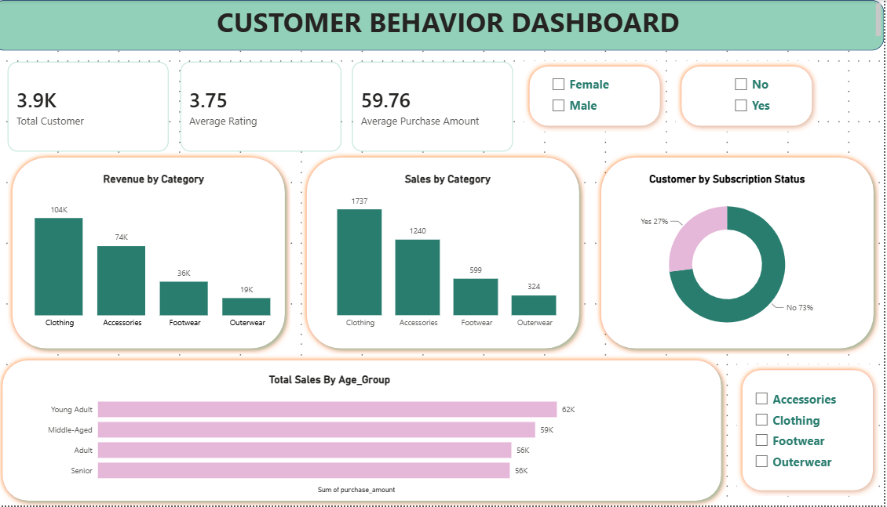

# Customer Behavior Analysis

## Overview
End-to-end analysis of a 3,900-customer retail dataset to uncover purchasing
patterns, customer segments, and revenue drivers. The project follows a
three-stage pipeline: data cleaning and feature engineering in Python,
analytical querying in MySQL, and an interactive dashboard in Power BI.

## Tools & Skills
- **Python (pandas): data cleaning, feature engineering (age grouping via
  quantile binning, purchase frequency mapping)
- **MySQL: 10 analytical queries using window functions (`ROW_NUMBER`),
  CTEs, subqueries, and conditional aggregation
- **Power BI: interactive dashboard with KPI cards, category-level revenue
  breakdown, and slicers for gender/category/subscription status

## Key Insights
- Total revenue of $233K across 3,900 customers, with **Clothing** the
  leading category at $104K (~45% of revenue), followed by Accessories,
  Footwear, and Outerwear
- Only 27% of customers are subscribed, despite subscribers being flagged
  as a comparison group for average spend and repeat-purchase likelihood
- Average review rating across all products is 3.75/5
- Customers segmented into New / Returning / Loyal tiers based on purchase
  history, revealing.

## Files
- `Customer_Behavior_Analysis.ipynb` — data cleaning & feature engineering
- `Customer_Behavior_EDA.sql` — 10-query SQL analysis
- `Customer_Behavior_Dashboard.pbix` — Power BI dashboard
- `shopping_behavior_Dataset.csv` — source data (Kaggle)

## Dashboard Preview

